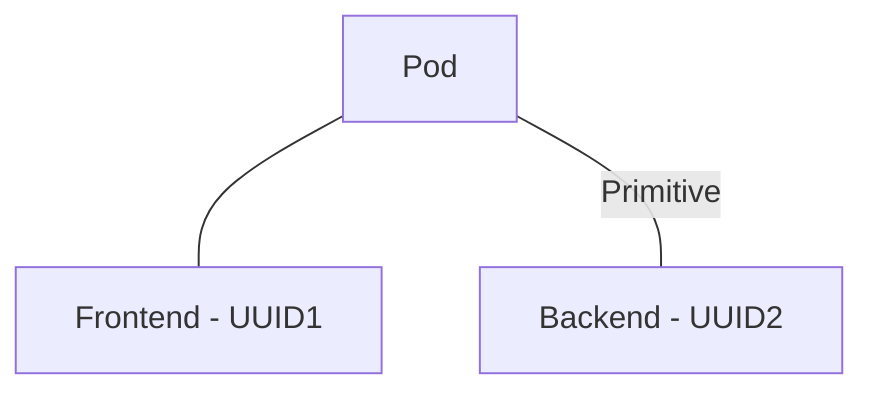
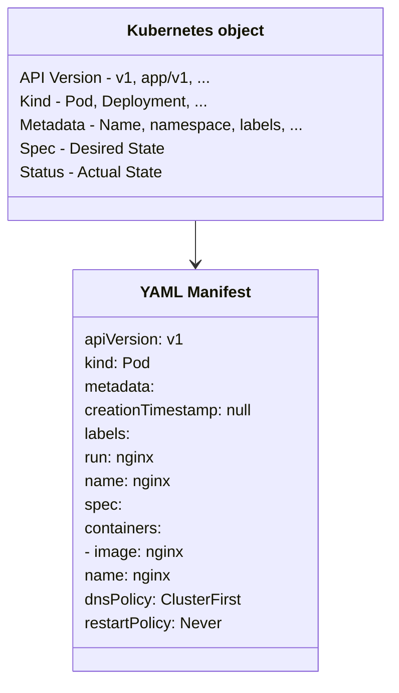
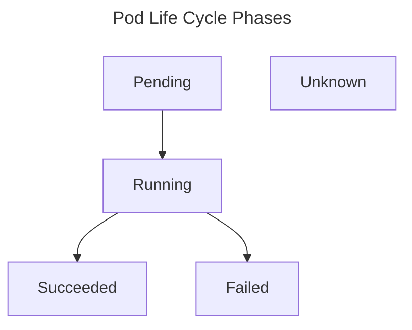

# Kubernetes Primitives
- Basic building blocks for creating and operating an application on the platform. Similar to object-orientated programming, a class defines the blueprint of real-world functionality. A kubernetes primitive is the equivalent of a class.
	- Eg - A pod in K8s is the class of which there can be many instances with their own identity. Each K8s object has a system generated unique identified (known as UID) to distinguish between entities of a system.


- Each and every K8s primitive follows a general structure which can be observed via the manifest of an object
	- API Version - Defines the structure of the primitive and uses it to validate the correctness of the data
	- Kind - defines the type of primitive - e.g. Pod or Service
	- Metadata - describes higher-level information about the object - e.g. name, namespace, labels or annotations
	- Spec - Specification or "spec" for short declares the desired state - e.g. how should this object look after it has been created
	- Status - Describes the actual state of the object

# Using `kubectl` to interact with the Kubernetes Cluster
- `kubectl` is the primary tool used to interact with the Kubernetes clusters from the command line.
- The `kubectl` execution consists of a command, a resource type, resource name, and optional command line flags:

`kubectl [command] [type] [name] [flags]`

An example of a full `kubectl` command can be found below
`kubectl get       pod    app    -o yaml`
`        [command] [type] [name] [flags]`

# Object Management
- You can create objects in K8s in two ways
	- ## Imperatively
		- Does not require manifest definition
		- Use `kubectl run` or `kubectl create` to create an object on the fly
		- Any configuration needed at runtime is provided by CLI options
		- Fast turnaround time without need to wrestle YAML structures
		- `kubectl run frontend --image=nginx --restart=Never --port=80`
	- ## Declaratively 
		- Creates objects from a manifest file (usually YAML) using `kubectl create` or `kubectl apply`
		- Benefit is reproducibility and improved maintenance, as file is usually checked into a version control
		- Recommended approach for production environments
```shell
vim pod.yaml
kubectl create -f pod.yaml
```

## Hybrid Approach
- Utilisng an imperative method to produce a manifest file
```shell
kubectl run frontend --image=nginx --restart=Never --port=80 \
-o yaml --dry-run=client > pod.yaml
vim pod.yaml
kubectl create -f pod.yaml
kubectl describe pod frontend
```
## Notable Commands
### Deleting an object
- Can delete Kubernetes object utilising the `delete` command offering two options
	- Deleting an object via providing the name
	- Deleting an object via pointing to the YAML manifest that created it

```sh
kubectl delete pod frontend
kubectl delete -f pod.yaml
```

### Editing a live object
- If you have an object created and wish to make further changes to the live object, you can use the `edit` command. After saving the object definition in the editor, Kubernetes will try and reflect those changes in the live object
```sh
kubectl edit pod frontend
```

### Replacing a live object
- If you wish to replace the definition of an existing object declaratively, use the `replace` command, overwriting the live configuration with the one within the provided YAML manifest.
``` sh
kubectl replace -f pod.yaml
```

### Updating a live object
- The `create` command instantiates a new object, trying to execute the `create` command for an existing object will produce an error. The `apply` command is used to update an existing object in its entirety or just incrementally.
- Note - `apply` command with behave similarly to the `create` command if the object does not exist yet. Requiring a full definition within the YAML file
```sh
kubectl apply -f pod.yaml
```

# Understanding Pods
- The most important primitive within the Kubernetes API is the Pod
- The pod lets you run a containerised application
- A pod can consume other services like a persistent storage, configuration data, and much more
- A pod can be thought of as a wrapper for running containers including the mediator functionality with other Kubernetes objects

# Containerisation Process
- Kubernetes is a container orchestrator that uses a container runtime to instantiate containers inside of pods
- By default, the runtime used is Docker

## Container Concepts
- A container packages an application into a single unit of software including its runtime environment and ocnfiguration
- Unit of software usually includes
	- Operating System (OS)
	- Applications source code (Binary)
	- Dependencies
	- Other system tools required
- Goal of a container is to decouple the runtime environment from the application 
- Process of bundling an application into a container is referred to as _containerisation_.
	- Works on instructions defined within a _Dockerfile_ which explicitly spells out what needs to happen when software is built
	- Result of the operation is an image which is usually published to a registry for consumption by other stakeholders

# Creating Pods
- The pod definition needs to state an image for every container
- Upon creation of the Pod object, the Container Runtime Engine will check if the container image already exists locally, if it does not exist it will download it from a container registry.
- `run` command is central entry point for creating Pods imperatively.

# Listing Pods
- `kubectl get pods` can list pods within the cluster

# Pod Life Cycle Phases
- Kubernetes is a state engine with asynchronous control loops
- Takes a moment to retrieve the image and start the container
- Upon Pod creation the object goes through several life cycle phases



| Option      | Description                                                                                     |
| ----------- | ----------------------------------------------------------------------------------------------- |
| `Pending`   | The pod has been accepted by the Kubernetes system, but one or more images has not been created |
| `Running`   | At least one container is still running, or in the process of starting or restarting            |
| `Succeeded` | All containers in the Pod terminated successfully                                               |
| `Failed`    | Containers in the Pod terminated, at least one failed with an error                             |
| `Unknown `  | The state of the Pod could not be obtained                                                      |

# Rendering Pod Details
- Table produced by the `get` command provides high-level information about a Pod, a deeper dive can be obtained via the `describe` command
- Terminal output contains the metadata information of a Pod, the containers it runs and the event logs, such as failures when the Pod was scheduled.

# Accessing Logs of a Pod
- `logs` command downloads the log output of a container
- Can stream the logs with the command line option `-f`
- Upon container restart, the previous container logs will not be available. It is possible to get the previous container logs via the `-p` flag

# Executing a Command in Container
- Utilise the `exec` command to open a shell in the container to explore it interactively
	- `kubectl exec -it <pod> -c <container> -- /bin/sh`
- It is possible to execute a single command inside of a container by removing the `-it` flag and providing the relevant command after the two dashes `--` 
	- `kubectl exec <pod> -c <container> -- date`

# Deleting a Pod
- To delete or remove a Pod, the `delete` command can be used
	- `kubectl delete pod <pod>`
- Kubernetes will attempt to delete the Pod _gracefully_, which can take anywhere from 5-30 seconds allowing for requests to complete
- Can alternatively delete a Pod via pointing the `delete` command to the YAML manifest
	- `kubectl delete -f pod.yaml`

# Configuring Pods
## Declaring Environment Variables
- Defining Environment Variables in the Pod YAML manifest is easy, add or enhance the section `env` of a container
- Every environment variable consists of a key-value pair, represented by the attributes `name` and `value`
- Recommended to follow standard of using upper-case letters and underscores to separate words
```yaml
apiVersion: v1
kind: Pod
metadata:
  name: spring-boot-app
spec:
  containers:
  - image: jmowlaisas/spring-boot-app.1.5.3
    name: spring-boot-app
    env:
    - name: SPRING_PROFILES_ACTIVE
      value: prod
    - name: VERSION
      value: '1.5.3'
```
- 2 environment varibales
	- `SPRING_PROFILES_ACTIVE` with value of `prod`
	- `VERSION` with value of `'1.5.3'`

## Defining a Command with Arguments
- In a Pod definition, the redefinition of the image `ENTRYPOINT` and `CMD` instructions or assigning a command to execute for the container if has not already been specified by the image. This can be performed by the `command` and `args` attributes for a container
	- `command` overrides the images `ENTRYPOINT` instruction
	- `args` replaces the `CMD` of an image

# Understanding Namespaces
- Namespaces are an API construct to avoid naming collisions 

## Listing Namespaces
- `kubectl get namespaces` will list the namespaces within the Kubernetes cluster
- `default` namespace hosts objects that have not been assigned to an explicit namepsace
- Namespaces prefixed with `kube-` are not considered end user-namespaces

## Creating and Using a Namespace
- Can create a namespace with the `create namespace` command
``` sh
kubectl create namespace code-red
```
- Or via a YAML manifest
```yaml
apiVersion: v1
kind: Namespace
metadata:
  name: code-red
```
- Once a namespace is created can create objects within it via providing the `--namespace` or `-n` with the command

## Deleting a Namespace
- Deleting a namespace has a cascading effect on the object existing within it. Deleting a namespace will automatically delete its objects

# Exercises
1. Create a new Pod named `nginx` running the image `nginx:1.17.10`. Expose the container port 80. The Pod should live in the namespace named `ckad`.

``` sh
kubectl create namespace ckad -o yaml --dry-run=client > namespace.yaml
kubectl apply -f namespace.yaml

kubectl run nginx --image=nginx:1.17.10 --port=80 --namespace=ckad --restart=Never -o yaml --dry-run=client > pod.yaml

kubectl apply -f pod.yaml
```

2. Get the details of the Pod including its IP address.
``` sh
kubectl -n ckad describe pod nginx
kubectl -n ckad describe pod nginx | grep -i ip
export POD_IP=`kubectl -n ckad describe pod nginx | grep IP -m1 | awk -F':' '{print $2}' | xargs`
echo $POD_IP
```

3. Create a temporary Pod that uses the `busybox` image to execute a `wget` command inside of the container. The `wget` command should access the endpoint exposed by the `nginx` container. You should see the HTML response body rendered in the terminal.
``` sh
kubectl run mypod --image=busybox --namespace=ckad --restart=Never -o yaml --dry-run=client > mypod.yaml -- /bin/sh -c "wget $POD_IP"
cat mypod.yaml
kubectl apply -f mypod.yaml
```
4. Get the logs of the `nginx` container.
```sh
kubectl -n ckad logs mypod
```
5. Add the environment variables `DB_URL=postgresql://mydb:5432` and `DB_USERNAME=admin` to the container of the `nginx` Pod.
```yaml
apiVersion: v1
kind: Pod
metadata:
  creationTimestamp: null
  labels:
    run: nginx
  name: nginx
  namespace: ckad
spec:
  containers:
  - image: nginx:1.17.10
    name: nginx
    env:
    - name: DB_URL
      value: postgresql://mydb:5432
    - name: DB_USERNAME
      value: admin
    ports:
    - containerPort: 80
    resources: {}
  dnsPolicy: ClusterFirst
  restartPolicy: Always
status: {}
```
6. Open a shell for the `nginx` container and inspect the contents of the current directory `ls -l`.
``` sh
kubectl -n ckad exec nginx -- ls -l
```
7. Create a YAML manifest for a Pod named `loop` that runs the `busybox` image in a container. The container should run the following command: `for i in {1..10}; do echo "Welcome $i times"; done`. Create the Pod from the YAML manifest. What’s the status of the Pod?
```sh
kubectl run loop --image=busybox -n ckad --restart=Never -o yaml --dry-run=client > loop.yaml -- /bin/sh -c 'for i in {1..10}; do echo "Welcome $i times"; done'
kubectl apply -f loop.yaml
kubectl -n ckad get pods loop
```
8. Edit the Pod named `loop`. Change the command to run in an endless loop. Each iteration should `echo` the current date.
```yaml
apiVersion: v1
kind: Pod
metadata:
  creationTimestamp: null
  labels:
    run: loop
  name: loop
  namespace: ckad
spec:
  containers:
  - args:
    - /bin/sh
    - -c
    - while true; do date; sleep 10; done
    image: busybox
    name: loop
    resources: {}
  dnsPolicy: ClusterFirst
  restartPolicy: Never
status: {}
```

```sh
kubectl delete -f loop.yaml
kubectl apply -f loop.yaml
```

9. Inspect the events and the status of the Pod `loop`.
``` sh
kubectl describe pod loop -n ckad
```
10. Delete the namespace `ckad` and its Pods.
```sh
kubectl delete -f namespace.yaml
```

